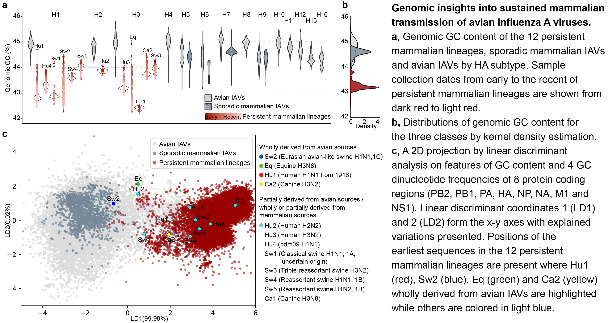
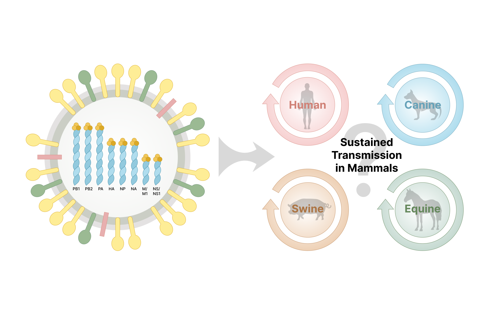

# Genomic insights into sustained mammalian transmission of avian influenza A viruses

Very few lineages of influenza A virus (IAV) have evolved sustained transmission in mammals. Why this is so remains largely unknown and the possibility of avian IAVs achieving sustained mammalian transmission is a pervasive concern. All available whole genomes of IAVs were assessed for their GC content and GC containing dinucleotide frequencies. Persistent mammalian lineages showed declining trends and could be accurately separated from avian lineages. Early viruses of the persistent mammalian lineages were also distinguishable, by reduced GC related content, from IAVs in birds and sporadic mammalian infections. Of note, the genotype of recent highly pathogenic 2.3.4.4b H5 viruses mostly detected in gulls also showed lower GC related content, and subsequently infected mink and foxes with evident mammalian transmissibility. The findings here suggest that the pattern of reduced GC related content in avian IAVs is one of predictors of enhanced ability to persist in mammals and should be included in risk assessment tools for pandemic influenza.



# Content
+ The repo contains all analyzed data in this study including the phylogenetic trees of eight protein coding regions and H5 gene for recently emerging H5Nx, the summary of statistics for genomic GC content, GC dinucleotide frequency and SVM model files. 

+ The influenza A virus genomic data are downloaded from GISAID with accession numbers found in EPI_SET_20220531ye and EPI_SET_250116bq at https://www.gisaid.org/.

# Risk assessment tool


+ The tool is publicly available at https://iav-transmission.org/ which has been tested by commonly used browsers (Google Chrome, Firefox, Safari and Microsoft Edge).
+ It is designed to assess the risk of sustained transmission in mammals for avian or recently zoonotic influenza A viruses.
+ It classifies mammalian IAVs as from either persistent (positive class) or sporadic (negative class) mammalian infections that achieved high accuracies of 99.61% for training (5-fold cross validation balanced accuracy = 99.13%) and 99.16% for testing.  
+ It is user-friendly by uploading eight protein coding regions (HA, NA, NP, PA, PB1, PB2, M1 and NS1) or eight nucleotide segments (HA, NA, NP, PA, PB1, PB2, MP and NS) for this risk assessment.
+ The source codes for the website is accesible at https://github.com/id-bioinfo/IAVs_sustained_transmission_prediction_website.
+ The classifier was based on a support vector machine (SVM) model implemented in LIBSVM v3.3 with linear kernel (https://github.com/cjlin1/libsvm).
+ A demo to apply our SVM model to test the risk of sustained mammalian transmission for recently zoonotic mink H5 viruses.
```bash
#compute the features of GC content and GC dinucleotide frequency (CpG, GpC, GpG and CpC) from fasta files in LIBSVM format
#please firstly edit the path to fasta files in SVM_model/computeFeature.py
python computeFeature.py
#apply our SVM model for the risk assessment
modelfile=SVM_model/cds/training_svm.model
testfile=SVM_model/demo_minkH5_cds/gc_content_dinucleotide_libsvm.txt
#the result is saved in $testfile"_predict"
#the installation and usage of libsvm-3.3 please refer to https://github.com/cjlin1/libsvm.
libsvm-3.3/svm-predict $testfile $modelfile $testfile"_predict"
```
+ To train and verify the developed SVM model
```
#traingfile and testfile are in folder "SVM_model"
#training
libsvm-3.3/svm-train -t 0 -w-1 16 $trainfile $modelfile
#testing
libsvm-3.3/svm-predict $testfile $modelfile $testfile"_predict"
```
